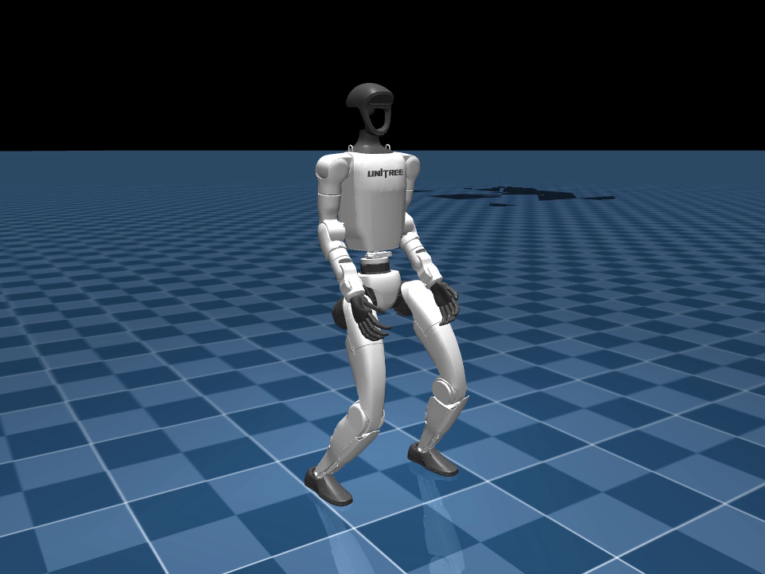

# G1 mjlab Locomotion

[](LICENSE)
[](pyproject.toml)

Evidence-led reinforcement-learning infrastructure for Unitree G1 standing and future locomotion,
built on [mjlab](https://github.com/mujocolab/mjlab), MuJoCo Warp, native MuJoCo, and RSL-RL PPO.

[](docs/assets/standing-v1/deterministic-standing-trial-000.mp4)

_Click the image for a 15-second deterministic native-MuJoCo playback. No learning or exploration
occurs during playback._

Walking-v1 is under development and has no qualified downloadable policy yet. Its nominal-action
locomotion bootstrap, 0.4–0.8 m/s command distribution, PPO smoke path, legally redistributable gait
reference, and frozen anti-shuffle evaluator are implemented. See the
[walking method decision](docs/walking-method-decision.md); this is infrastructure and experiment
evidence, not a walking-policy result.

## Run the trained policy

The `standing-v1` release runs deterministically in native MuJoCo on CPU. It does not start PPO or
require a training GPU.

```console
git clone --branch v0.2.0 https://github.com/Elaybarnoam/g1-mjlab-locomotion.git
cd g1-mjlab-locomotion
uv sync --extra native
uv run g1-mjlab install-policy standing-v1
uv run g1-mjlab play-policy --policy policies/standing-v1
```

The installer cryptographically verifies the release archive and every runtime artifact before an
atomic installation. See [Using published policies](docs/using-published-policies.md) for bundle
contents, custom locations, and the separately distributed resumable training checkpoint.

## Current verified result

Standing-v1 was qualified for the declared flat-ground simulation scope on 2026-09-09.

| Evidence | Result |
| --- | ---: |
| Training seeds | 42, 43, 44 |
| Training transitions per seed | 6,144,000 |
| Selected policy | seed 42, `model_999.pt` |
| mjlab / MuJoCo Warp final test | **100/100** strict 60-second trials |
| Native MuJoCo / ONNX final test | **100/100** on the same initial states |
| Two-sided Wilson 95% interval | 0.9630–1.0000 |
| Median / worst mjlab drift | 0.0215 / 0.0407 m |
| Maximum torso tilt | 3.38° |
| Minimum post-settling pelvis height | 0.701 m |
| PyTorch/ONNX trajectory-state parity | passed, max action error `4.18e-7` |

The evidence summary and media hashes are committed under [`evidence/standing-v1`](evidence/standing-v1)
and [`docs/assets/standing-v1`](docs/assets/standing-v1/media-manifest.json). Raw training artifacts,
executable policies, compiled models, and machine-private paths are excluded from Git. Qualified
policy binaries are versioned separately as GitHub Release assets.

## What this proves—and what it does not

The selected deterministic policy maintained the declared height, tilt, support, drift, and finite-
state limits across the frozen final suites in mjlab/MuJoCo Warp and native MuJoCo/ONNX.

This is **not** cross-engine validation: both backends use the MuJoCo model family. It is not proof
of push recovery, randomized dynamics, rough-terrain standing, deployable state estimation,
hardware safety, sim-to-real transfer, or walking. The actor currently receives simulated pelvis-
site linear velocity that a physical robot must estimate or replace.

## System at a glance

```text
256 parallel G1 worlds × 24 control steps
                  │
                  ▼
       PPO + GAE (RSL-RL 5.5.0)
                  │
                  ▼
  hashed checkpoint + observation normalizer
           ┌──────┴──────┐
           ▼             ▼
  mjlab evaluation   ONNX export
                           │
                           ▼
                 native MuJoCo evaluation
```

- Physics step: 0.005 s (200 Hz)
- Policy/control step: 0.020 s (50 Hz)
- Actor: 99 → 512 → 256 → 128 → 29, ELU
- Critic: 111 → 512 → 256 → 128 → 1, ELU
- Actions: 29 Gaussian joint-position offsets around the nominal G1 pose
- Controller: `q_target = q_nominal + action_scale × action`; built-in position actuators apply
  joint-specific stiffness, damping, armature, and force limits every physics step

See [Algorithm](docs/algorithm.md) and [Controller contract](docs/controller-contract.md) for exact
semantics.

## Install

The lightweight wheel contains reporting and orchestration code; canonical configuration and
reviewed evidence live in the source repository. Importing the package does not initialize CUDA.

```console
git clone https://github.com/elaybarnoam/g1-mjlab-locomotion.git
cd g1-mjlab-locomotion
uv sync --group dev --extra native --extra video
uv run g1-mjlab validate-config --config configs/standing-v1/train.json
uv run pytest -m "not simulator and not gpu and not slow" --cov --cov-report=term-missing
```

Training uses the exact mjlab revision recorded in `pyproject.toml` and
[`runtime-lock.json`](configs/standing-v1/runtime-lock.json). Linux x86-64 with an NVIDIA CUDA
runtime is the qualified training route. Follow [Reproducibility](docs/reproducibility.md) before a
GPU run; environment count is a measured configuration, not a portable hardware promise.

```console
uv sync --group dev --extra train
uv run g1-mjlab train \
  --config configs/standing-v1/train.json \
  --output runs/standing-v1-seed-42
```

## Deterministic evaluation and playback

Evaluation loads the frozen actor mean and never constructs an optimizer. A complete run bundle is
required because the public repository does not commit executable checkpoints or compiled models.

```console
uv run g1-mjlab evaluate \
  --config configs/standing-v1/train.json \
  --checkpoint runs/standing-v1-seed-42/checkpoints/model_999.pt \
  --output runs/standing-v1-seed-42/evaluation/development \
  --trials 20 --horizon-seconds 60

uv run g1-mjlab play-native \
  --run runs/standing-v1-seed-42 \
  --scenarios runs/standing-v1-seed-42/evaluation/final-100x60/summary.json
```

Only load locally produced or otherwise trusted PyTorch checkpoints. PyTorch checkpoint loading is
not a safe interchange format for untrusted files.

## Repository map

| Path | Purpose |
| --- | --- |
| `src/g1_mjlab/` | Standing task, PPO lifecycle, evaluation, qualification, deployment, reports |
| `configs/standing-v1/` | Canonical train/smoke configuration and qualified runtime lock |
| `configs/walking-v1/` | Audited walking reference, manifest, and implemented task configuration |
| `tests/` | Pure boundary tests plus opt-in simulator integration |
| `evidence/standing-v1/` | Small, reviewed, non-executable result summaries |
| `docs/assets/standing-v1/` | Curated stills/video and hash manifest |
| `docs/` | Architecture, algorithm, controller, evidence, reproducibility, limitations |

## Documentation

- [Architecture and data flow](docs/architecture.md)
- [PPO, GAE, returns, and networks](docs/algorithm.md)
- [Policy inputs, actions, and PD controller](docs/controller-contract.md)
- [Evaluation protocol and evidence](docs/evaluation-and-evidence.md)
- [Reproducibility and clean setup](docs/reproducibility.md)
- [Using published policies](docs/using-published-policies.md)
- [Limitations and roadmap](docs/limitations-and-roadmap.md)
- [Walking reference provenance and audit](docs/walking-reference.md)
- [Walking-v1 command, phase, and policy contract](docs/walking-control-contract.md)
- [Walking-v1 MDP and incentive design](docs/walking-mdp.md)
- [Walking method decision and bootstrap](docs/walking-method-decision.md)
- [Walking PPO lifecycle](docs/walking-training-lifecycle.md)
- [Walking physical-contact evaluation v2](docs/walking-evaluation-v2.md)
- [Walking reference semantics v2](docs/walking-reference-v2.md)
- [Walking deterministic live viewer](docs/walking-live-viewer.md)
- [Walking Stage 19 contact state and reward profiles](docs/walking-stage19-rewards.md)
- [Walking campaign execution and recovery](docs/walking-campaigns.md)

## Contributing and license

Run Ruff, MyPy, the complete test suite, and package checks before a pull request. Behavioral
changes require a new versioned task/configuration and separate evidence; historical results are
immutable. See [CONTRIBUTING.md](CONTRIBUTING.md) and [SECURITY.md](SECURITY.md).

Original project code is licensed under the [MIT License](LICENSE). Dependencies and robot assets
retain their own licenses; see [THIRD_PARTY_NOTICES.md](THIRD_PARTY_NOTICES.md). No affiliation with
or endorsement by Unitree, the mjlab developers, Google DeepMind, NVIDIA, ETH Zurich, or OpenAI is
implied.
