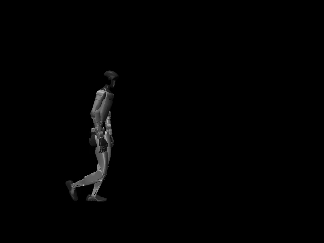
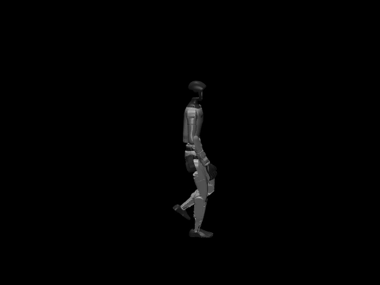
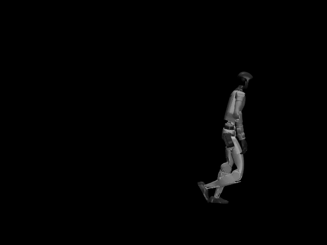

# Walking reference provenance and audit

The first walking reference is `nvidia-soma-g1-neutral-walk-a057-cycle-v1`: one complete
same-foot gait cycle selected from NVIDIA SOMA's already-retargeted Unitree G1 sample
`Neutral_walk_forward_002__A057`. This is a kinematic target for training. It is not a trained
policy and the preview does not demonstrate dynamic balance.







The [real-time reference preview](assets/walking-v1/reference-gait-a057.mp4) shows the exact
processed arrays at 50 fps in MuJoCo forward kinematics. No policy, controller, contacts, or physics
steps are active in this video.

## Why this reference

The clip contains ordinary forward walking with alternating feet, visible knee flexion, and
coordinated arm swing. Its measured cycle speed is 1.164 m/s, a normal everyday-walking target and
not the original provisional 0.4–0.8 m/s range. W03 must therefore master this reference speed
first; lower-speed behavior requires a separately audited cadence/reference transform rather than
silently stretching this clip.

NVIDIA's repository is Apache-2.0. More importantly, a repository maintainer explicitly confirmed
that the ten bundled sample BVH files are released under Apache-2.0. That confirmation does not
cover the larger Bones-SEED dataset, which this project neither downloads nor redistributes. The
committed NPZ is a small processed derivative of the approved sample. Exact source URLs, commit,
hashes, units, conversion basis, model identity and derivative hash are in
`configs/walking-v1/motion-manifest.json`.

## Processing contract

- The paired BVH declares 1,088 frames and a frame time of 0.008333 seconds (120 fps nominal).
- SOMA root positions are centimeters; all output positions are meters.
- Root angles are intrinsic XYZ degrees and become normalized WXYZ quaternions.
- The 29 `_dof` columns must exactly match the declared MuJoCo G1 order and become radians.
- Source frames 409 through 537 inclusive form the selected same-foot cycle. Horizontal travel is
  rotated to +X and starts at zero without removing the cycle's forward displacement.
- Resampling to the 50 Hz policy rate uses linear interpolation for positions/joints and
  shortest-path quaternion SLERP. The final endpoint is retained.
- MuJoCo forward kinematics uses the G1 XML from the pinned mjlab commit. Four ankle-roll samples
  were constrained by at most 0.0200 rad to preserve a 0.02 rad joint-limit margin.
- Foot labels are derived from ankle-link height and horizontal speed with explicit hysteresis and
  a 40 ms debounce. They are training labels, not measured force contacts.

The deterministic NPZ contains `fps`, 29-joint position and velocity arrays, all 30 robot body
positions/orientations and linear/angular velocities, ordered joint/body names, and two foot-contact
columns. It is always loaded with `allow_pickle=False`.

## Audit result and limitations

The machine-readable audit passes the W02 ingestion gate: all arrays are finite; all joints remain
inside the pinned model limits; both feet receive stance intervals; start/end contacts match; pose,
velocity and root-orientation seams satisfy the predeclared thresholds. The cycle is 1.06 s at
50 Hz, has 54 retained samples, and advances at 1.164 m/s. Exact measured values are in
`configs/walking-v1/reference/audit.json`.

This is not yet a controller-feasibility result. The reference reaches 10.16 rad/s at the left knee,
has no derived double-support frames, and has 20 frames with neither ankle classified as planted.
Those facts may reflect the contact heuristic, retargeting, or an aggressive swing phase. W04 and
W05 must test PD tracking, torque, actual simulator contacts and foot slip before any long PPO run.
If those probes fail, this reference must be refined or replaced; reward tuning must not hide an
infeasible target.

## Reproduction

Download the source CSV from the pinned URL in the manifest, install the `native` extra, and run:

```console
uv run --extra native g1-mjlab prepare-motion \
  --source-csv PATH/Neutral_walk_forward_002__A057.csv \
  --model-xml PATH/TO/PINNED/mjlab/asset_zoo/robots/unitree_g1/xmls/g1.xml \
  --output configs/walking-v1/reference/g1-walk-a057-cycle.npz \
  --audit configs/walking-v1/reference/audit.json
```

For visual inspection, install the video extra and run `g1-mjlab preview-motion` with the generated
NPZ, the same model XML, and a new output path. The command refuses to overwrite an existing video.

## Rejected candidate

CMU subject 91 trial 02 (`WalkStraight`) was investigated first. A direct ASF/AMC-to-BVH conversion
followed by a generic G1 mapping produced asymmetric and implausible foot heights because the
skeleton axes and IK assumptions were not calibrated for that source. It was rejected before
publication and none of those local files are part of this repository. Open-source retargeting code
alone would not establish rights to derived motion, which is another reason not to ship that probe.
